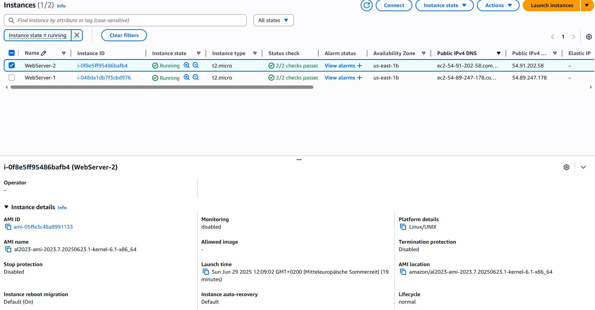
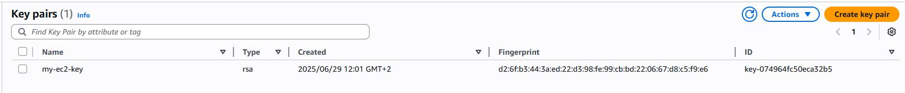
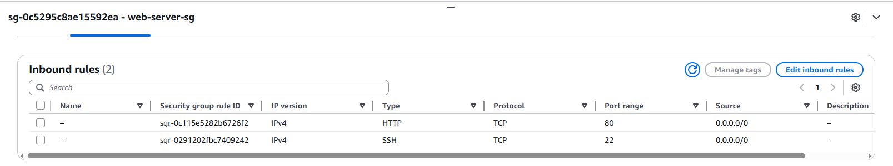
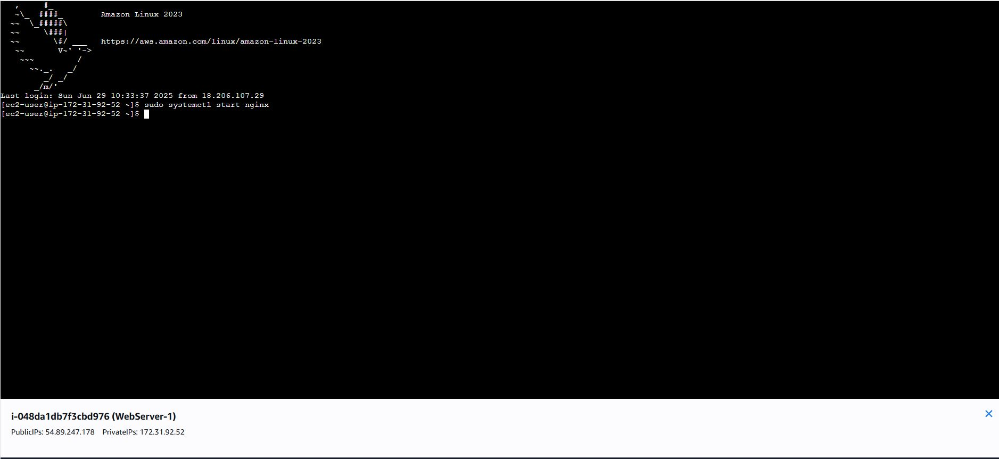
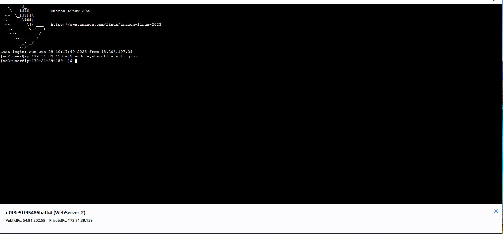
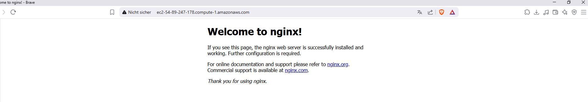
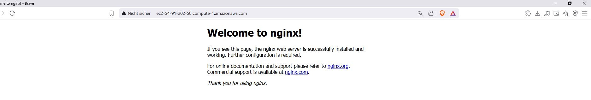
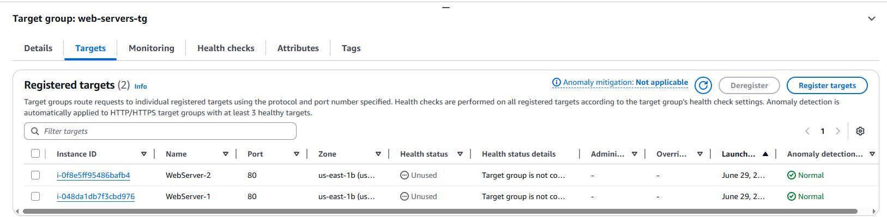
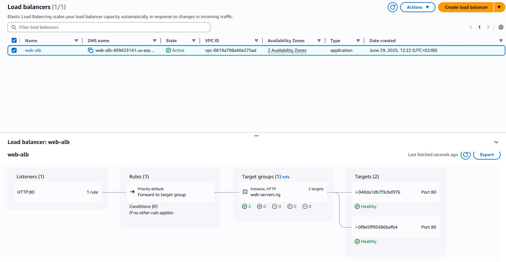

# AWS EC2 Homework - Звіт про виконання

**Студент:** [Ваше ім'я]  
**Дата:** [Дата виконання]  
**Курс:** [Назва курсу]

---

## 📋 Зміст

1. [Запущені EC2 інстанси](#1-запущені-ec2-інстанси)
2. [Пара ключів (Key Pair)](#2-пара-ключів-key-pair)
3. [Security Group](#3-security-group)
4. [Підключення до інстансу через SSH](#4-підключення-до-інстансу-через-ssh)
5. [Встановлення та запуск Nginx](#5-встановлення-та-запуск-nginx)
6. [Перевірка роботи Nginx](#6-перевірка-роботи-nginx)
7. [Target Group](#7-target-group)
8. [Application Load Balancer](#8-application-load-balancer)
9. [Перевірка роботи балансування](#9-перевірка-роботи-балансування)
10. [Зупинка інстансів](#10-зупинка-інстансів)
11. [Висновки](#висновки)

---

## 1. Запущені EC2 інстанси

**📝 Завдання:**  
Створити два EC2 інстанси з параметрами:
- AMI: Amazon Linux 2
- Тип інстансу: t2.micro
- Стан: Running

**⚙️ Виконання:**
- Перейшов до AWS EC2 Dashboard → Instances
- Створив два інстанси з потрібними параметрами

**📸 Скрін:**
<!-- Вставте скрін тут -->



**✅ Що має бути видно на скріні:**
- Два інстанси у стані "Running"
- AMI: Amazon Linux 2
- Instance Type: t2.micro
- Instance ID та Public DNS для кожного інстансу

---

## 2. Пара ключів (Key Pair)

**📝 Завдання:**  
Створити нову пару ключів для підключення до інстансів

**⚙️ Виконання:**
- Перейшов до EC2 Dashboard → Key Pairs
- Створив нову пару ключів для SSH підключення

**📸 Скрін:**
<!-- Вставте скрін тут -->


**✅ Що має бути видно на скріні:**
- Назва створеної пари ключів
- Тип ключа (RSA)
- Дата створення

---

## 3. Security Group

**📝 Завдання:**  
Налаштувати Security Group з правилами для SSH (порт 22) та HTTP (порт 80)

**⚙️ Виконання:**
- Перейшов до Security Groups → Inbound Rules
- Налаштував правила доступу для портів 22 та 80

**📸 Скрін:**
<!-- Вставте скрін тут -->


**✅ Що має бути видно на скріні:**
- Правило для SSH (порт 22, протокол TCP)
- Правило для HTTP (порт 80, протокол TCP)
- Source: 0.0.0.0/0 для обох правил

---

## 4. Підключення до інстансу через SSH

**📝 Завдання:**  
Підключитися до інстансу через EC2 Instance Connect

**⚙️ Виконання:**
- Обрав інстанс та натиснув "Connect"
- Використав EC2 Instance Connect для підключення

**📸 Скрін:**
<!-- Вставте скрін тут -->



**✅ Що має бути видно на скріні:**
- Відкритий термінал з підключенням до інстансу
- Prompt з ec2-user@ip-адреса
- Успішне підключення

---

## 5. Встановлення та запуск Nginx

**📝 Завдання:**  
Встановити та запустити Nginx на інстансі

**⚙️ Виконання:**  
Виконав наступні команди:

```bash
# Оновлення системи
sudo yum update -y

# Встановлення nginx (спробувати першу команду, якщо не працює - другу)
sudo amazon-linux-extras install nginx1 -y
# або
sudo yum install nginx -y

# Запуск nginx при завантаженні системи
sudo systemctl enable nginx

# Запуск nginx
sudo systemctl start nginx

# Перевірка статусу
sudo systemctl status nginx
```

**📸 Скрін:**
<!-- Вставте скрін тут -->


**✅ Що має бути видно на скріні:**
- Результат виконання команд встановлення
- Статус nginx (active/running)
- Підтвердження успішного запуску сервісу

---

## 6. Перевірка роботи Nginx

**📝 Завдання:**  
Перевірити роботу веб-сервера через браузер

**⚙️ Виконання:**
- Скопіював Public DNS інстансу
- Відкрив адресу в браузері: `http://[PUBLIC-DNS]`

**📸 Скрін:**
<!-- Вставте скрін тут -->



**✅ Що має бути видно на скріні:**
- Дефолтна сторінка Nginx
- URL з публічним DNS інстансу
- Текст "Welcome to nginx!" або подібний

> **🔄 Примітка:** Повторив кроки 4-6 для другого інстансу

---

## 7. Target Group

**📝 Завдання:**  
Створити Target Group та додати до неї EC2 інстанси

**⚙️ Виконання:**
- Перейшов до Load Balancing → Target Groups
- Створив нову Target Group з параметрами HTTP:80
- Додав обидва EC2 інстанси до Target Group

**📸 Скрін:**
<!-- Вставте скрін тут -->


**✅ Що має бути видно на скріні:**
- Створена Target Group
- Targets: обидва EC2 інстанси
- Health status: Healthy для обох інстансів
- Protocol: HTTP, Port: 80

---

## 8. Application Load Balancer

**📝 Завдання:**  
Створити Application Load Balancer та приєднати до Target Group

**⚙️ Виконання:**
- Перейшов до Load Balancers
- Створив новий Application Load Balancer
- Налаштував маршрутизацію до створеної Target Group

**📸 Скрін:**
<!-- Вставте скрін тут -->


**✅ Що має бути видно на скріні:**
- Створений ALB у стані "Active"
- DNS name Load Balancer'а
- Listener: HTTP:80
- Target Group приєднана

---

## 9. Перевірка роботи балансування

**📝 Завдання:**  
Перевірити роботу веб-сервера через Application Load Balancer

**⚙️ Виконання:**
- Скопіював DNS name Application Load Balancer'а
- Відкрив адресу в браузері

**📸 Скрін:**
<!-- Вставте скрін тут -->


**✅ Що має бути видно на скріні:**
- Сторінка Nginx, що завантажена через ALB
- URL з DNS name Load Balancer'а
- Підтвердження роботи балансування навантаження

---

## 10. Зупинка інстансів

**📝 Завдання:**  
Зупинити EC2 інстанси для економії ресурсів

**⚙️ Виконання:**
- Повернувся до EC2 Dashboard → Instances
- Обрав обидва інстанси та зупинив їх (Stop instance)

**📸 Скрін:**
<!-- Вставте скрін тут -->


**✅ Що має бути видно на скріні:**
- Обидва інстанси у стані "Stopped"
- Instance State: Stopped
- Дата та час зупинки

---

## 📊 Висновки

### ✅ Результати виконання:
- [x] Створено 2 EC2 інстанси (t2.micro, Amazon Linux 2)
- [x] Налаштовано Security Group з правилами SSH/HTTP
- [x] Встановлено та запущено Nginx на обох інстансах
- [x] Створено Target Group з обома інстансами
- [x] Налаштовано Application Load Balancer
- [x] Перевірено роботу балансування навантаження
- [x] Зупинено інстанси після тестування

### 🎓 Засвоєні навички:
- Робота з AWS EC2 Console
- Створення та налаштування віртуальних машин
- Налаштування мережевої безпеки (Security Groups)
- Встановлення веб-сервера на Linux
- Робота з Application Load Balancer та Target Groups
- Управління ресурсами AWS

### 💡 Рекомендації для майбутнього:
- Регулярно перевіряти витрати в AWS Billing
- Використовувати більш обмежені Security Groups у продакшні
- Створювати резервні копії (AMI) налаштованих інстансів
- Додавати теги до ресурсів для кращого управління

---

## 🔧 Додаткові команди для перевірки

<details>
<summary>Розгорнути список корисних команд</summary>

```bash
# Перевірка статусу nginx
sudo systemctl status nginx

# Перезапуск nginx
sudo systemctl restart nginx

# Перегляд логів nginx
sudo journalctl -u nginx

# Перевірка відкритих портів
sudo netstat -tlnp | grep nginx

# Перевірка конфігурації nginx
sudo nginx -t

# Перегляд активних з'єднань
sudo ss -tulpn
```

</details>

---
